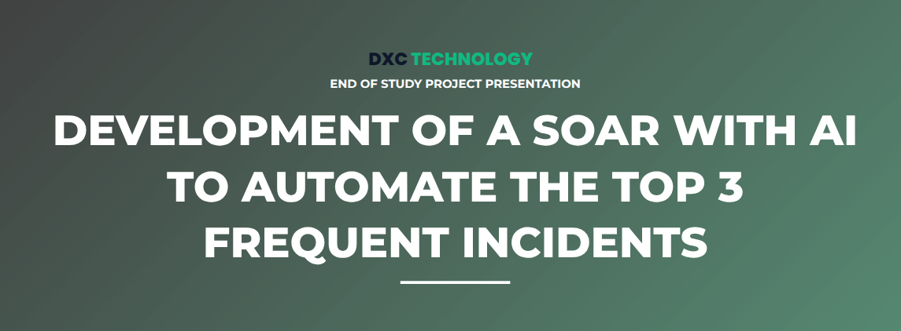
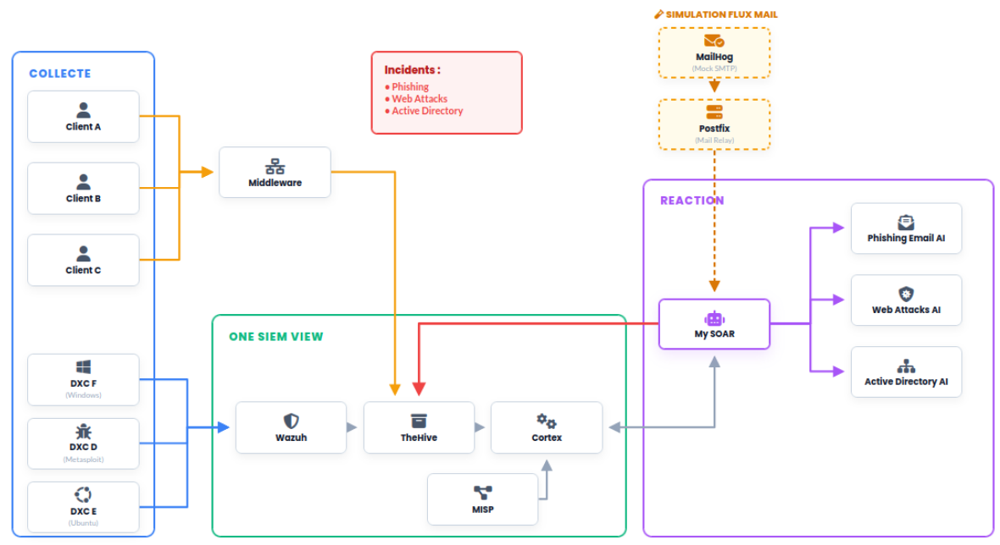
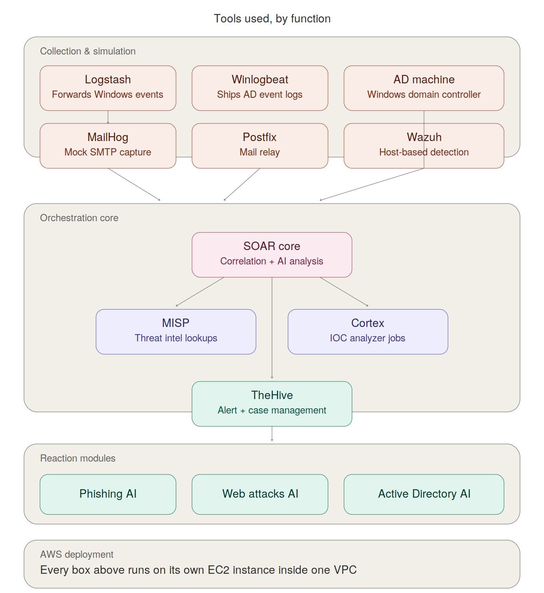
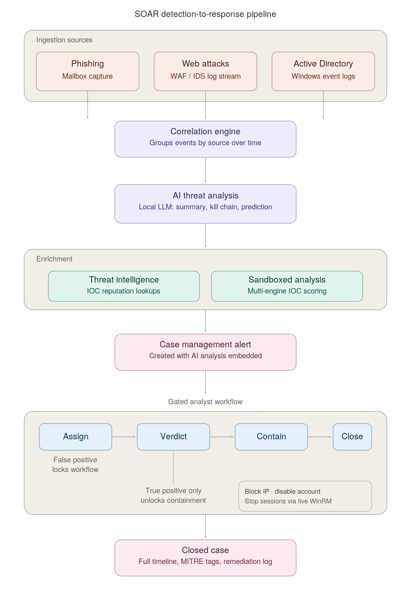
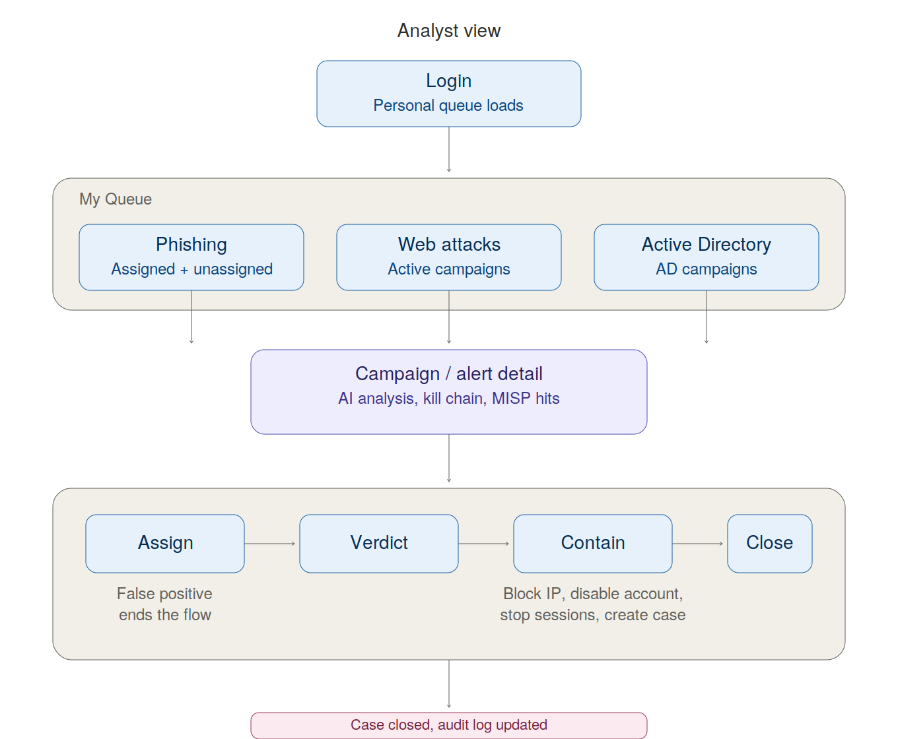
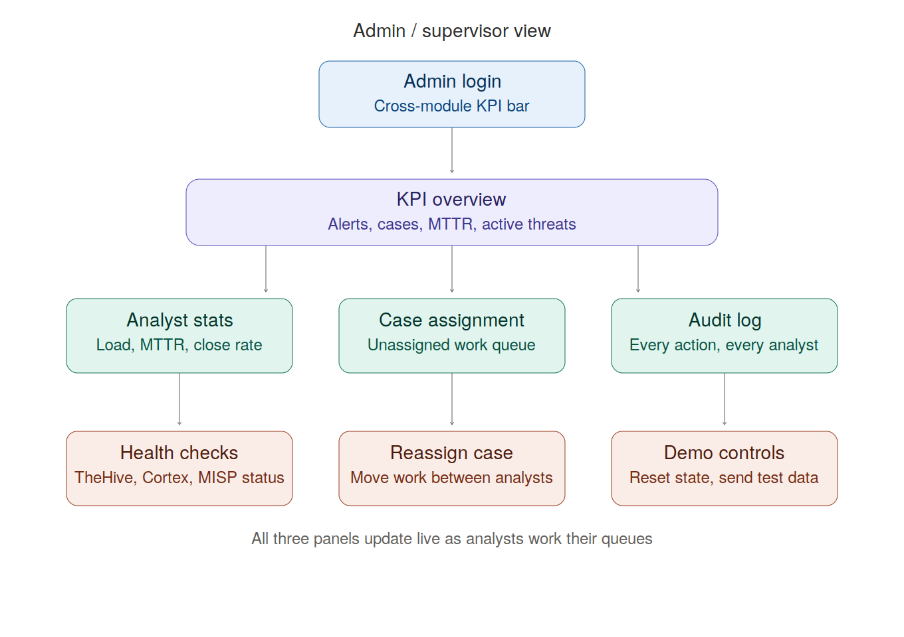
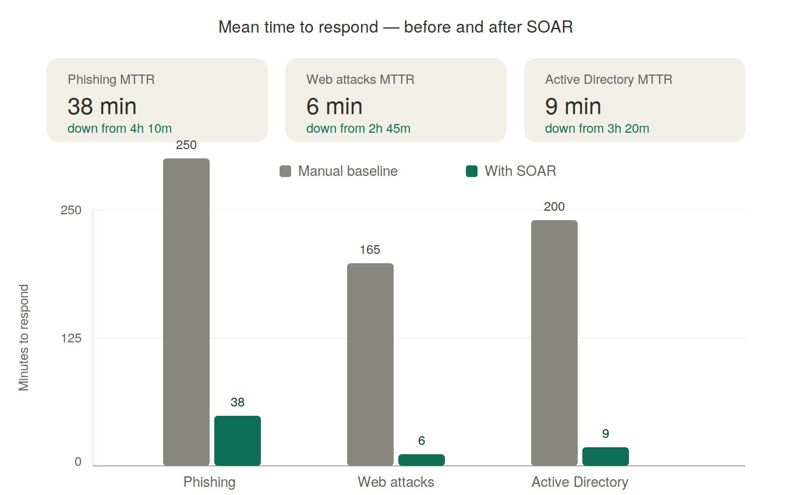
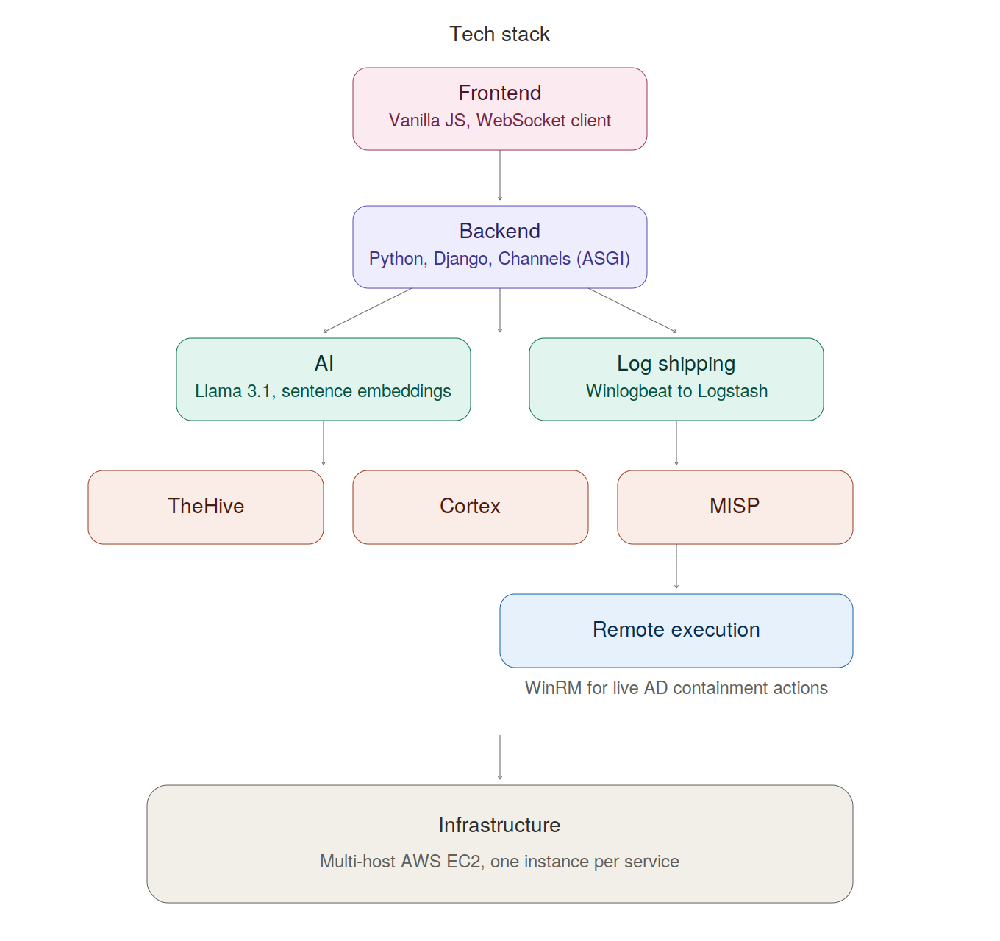

A full-stack Security Orchestration, Automation and Response platform built to demonstrate end-to-end SOC workflows: detection, AI-assisted triage, threat intelligence enrichment, and automated response — across phishing email, web application attacks, and Active Directory threats.

This project was built as a graduation/PFE project simulating a real-world SOC environment for a fictional organization, integrating several industry-standard security tools into a single orchestration layer.

> **Note:** This repository contains documentation and architecture only. The source code is not publicly available because this is an internal project intended for implementation. It contains proprietary business logic, environment-specific configurations, and infrastructure details that are not suitable for public release.

---

## Architecture overview

---

## Architecture overview

The diagram above shows the full lifecycle: three ingestion sources feed a shared correlation engine, which triggers AI threat analysis once enough events from the same source are seen. The result flows through threat-intel and sandbox enrichment into a case-management alert, and from there into a gated analyst workflow — assign, set verdict, contain, close — where containment actions are only unlocked after a true-positive verdict.

The backend is a Django application using an ASGI server for real-time delivery; every detection, correlation result, and analyst action is pushed to the browser over a persistent WebSocket connection so the dashboard updates live with no polling for time-critical events.

---

## Core components

**Ingestion layer.** Each module has its own collector. The phishing collector polls a mail capture sink and parses MIME content. The web-attack collector watches an inbound log directory and parses structured attack records. The AD collector exposes an authenticated REST endpoint that receives forwarded Windows Security and Sysmon events from a log-shipping agent; non-actionable noise (process creation, DNS telemetry, etc.) is filtered at ingestion so the analyst-facing event stream only contains security-relevant authentication and account-management events.

**Correlation engine.** Raw events are grouped by source indicator (attacking IP) within a rolling time window. Once a source crosses a minimum event threshold, the correlator assembles a campaign summary and hands it to the AI analysis layer. Re-analysis is triggered at increasing event counts so long-running campaigns get progressively richer assessments rather than one static verdict.

**AI threat analysis.** A locally-hosted instruction-tuned LLM is prompted with the structured campaign data and asked to return four things in a fixed format: a plain-language summary of attacker intent, the corresponding Cyber Kill Chain stage, a prediction of the attacker's likely next move, and a concrete recommended action. This keeps the model's output both human-readable and machine-parseable, since the same text is later embedded verbatim into the case record.

**Threat intelligence enrichment.** Every observable (IP, domain, URL, email address) extracted from an event is checked against a self-hosted threat-intel platform. Hits are surfaced inline in the dashboard and also pushed back as new indicators after an analyst confirms a true positive, so the threat-intel instance grows from the SOC's own confirmed incidents over time.

**Sandboxed IOC analysis.** Phishing-specific indicators are additionally submitted in parallel to a job-based analysis orchestrator running several detection engines (reputation lookups, malicious-URL databases, file/URL sandboxing). Results are polled asynchronously and merged into the verdict with a confidence boost when multiple engines agree, rather than blocking the UI on slow external lookups.

**Case management integration.** Every correlated campaign or detected phishing email becomes an alert in a dedicated case-management platform. Alerts deliberately wait until the AI analysis is available so the very first artifact an analyst sees already contains the kill-chain assessment — there is no separate "raw alert, then enrichment" step. When an analyst works the queue and confirms a true positive, the alert is promoted to a full case with the AI analysis embedded in the case description, observables registered, MITRE ATT&CK technique tagging applied, and a remediation checklist auto-generated from the actions actually executed.

**Guided analyst workflow.** Response actions in the UI are intentionally sequenced and gated: an analyst must claim ("assign") a campaign before a verdict can be entered, and the verdict must be confirmed as a true positive before any containment action becomes available. Marking something a false positive locks the response controls entirely. This mirrors real SOC playbook discipline and produces a clean, defensible audit trail rather than allowing ad hoc actions in any order.

**Active response actions.**
- IP blocking at the host firewall, with the same indicator simultaneously added to an internal blacklist and pushed to threat intel.
- Real remote execution against the Active Directory domain controller over WinRM for account containment: disabling a compromised account and forcibly terminating its active sessions, both performed with live PowerShell execution against the directory service rather than being simulated.
- One-click case creation that closes the loop: closes the working alert, finalizes the case timeline, and writes a structured remediation summary as a case comment.

**Admin / supervisor view.** A separate dashboard gives a team lead visibility across all three modules at once: case load and resolution time per analyst, an unassigned-work queue, a full audit log of every analyst action across the platform, and basic health checks on the integrated services.

---

## Views

**Analyst.** The day-to-day working surface — a personal queue split by module, a campaign or alert detail panel carrying the AI analysis and threat-intel hits, and the gated assign → verdict → contain → close sequence described above.

**Admin / supervisor.** A separate cross-module dashboard for team leads: KPIs, per-analyst load and MTTR, an unassigned-work queue for reassignment, a full audit trail, and health checks on the integrated services.

---

## Results — mean time to respond

Mean time to respond (MTTR) was tracked across all three modules against a manual-process baseline (a SOC analyst working the same detection sources without correlation, AI triage, or automated containment). The platform's correlation, AI-assisted analysis, and one-click containment actions cut MTTR by roughly 90-96% depending on the module, with the largest relative gain on web attacks where automated IP blocking removes almost all of the manual investigation step.

---

## Engineering decisions worth noting

- **Real-time delivery over polling.** New detections, correlation results, and AI verdicts are pushed to connected dashboards via WebSocket the moment they're available; periodic REST polling is reserved only for slower-changing aggregate statistics (KPIs, queue counts), which keeps the UI responsive without hammering the backend.
- **Aggressive payload trimming.** Several endpoints were re-profiled mid-project after they were found to be serializing far more data than the UI actually rendered (e.g. full case objects vs. the handful of fields shown in a KPI tile); trimming these cut payload sizes by roughly 90% on the busiest endpoints.
- **Idempotent alerting.** Campaign alerts are keyed so that re-analysis of an ongoing campaign updates the existing record rather than spawning duplicate alerts in the case-management tool — important once a single attacking IP can trigger five or six re-analyses as a campaign grows.
- **Noise filtering at the edge.** Endpoint telemetry (process creation, file writes, DNS queries) is filtered out before it ever reaches the database, since a single domain controller can generate thousands of these per minute and none of them are independently actionable for a SOC analyst in this context — only authentication and account-state events are persisted and correlated.
- **Graceful degradation.** Threat-intel and sandbox-analyzer calls run in non-blocking background tasks; if either service is temporarily unavailable, detection, correlation, and the analyst workflow continue uninterrupted and simply show the enrichment as pending.

---

## Tech stack

---

## Demo scenarios

The platform ships with simulator scripts (not included in this repo) that generate realistic, multi-stage attack campaigns against each module — multi-vector web attacks from several attacker IPs, a mixed batch of phishing and legitimate emails using real-but-defanged malicious indicators, and brute-force/credential-attack campaigns against Active Directory — to demonstrate the full detect → correlate → analyze → enrich → respond → document loop without requiring a live attacker.

A full walkthrough of the platform in action is available here: [Demo video](https://youtube.com/your-video-link)
